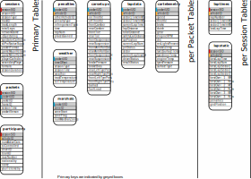

# F1 2020 Telemetry Recorder

[]()
[]()

The f1-2020-db package allows users to capture, unpack and save telemetry broadcast by the F1 2020 videogame to an SQLite database. It is designed with post-race analysis in mind, with a database structure that allows specific data to be queried within or across sessions.


Much of the code for parsing the packets has been adapted from the excellent package, [f1-2020-telemetry](https://f1-2020-telemetry.readthedocs.io/en/latest/), written by Guillaume Parent, to whom I owe my thanks.


This package is a work in progress and was meant as a good excuse to learn some SQL. Therefore it is not guaranteed to be supported in the future.


## Table of contents
- [F1 2020 Telemetry Recorder](#f1-2020-telemetry-recorder)
  - [Table of contents](#table-of-contents)
  - [Dependencies](#dependencies)
  - [Usage](#usage)
    - [Recording data](#recording-data)
    - [Retrieving data](#retrieving-data)
  - [Database schema](#database-schema)

---

## Dependencies

**Recording**
- f1-2020-telemetry
- pandas
- numpy

**Plotting**
- matplotlib
- scipy (for interpolation)


---

## Usage


### Recording data

Command line utility to be added

### Retrieving data

The data can be accessed using standard SQL queries, or at least those supported by [SQLite](https://sqlite.org/lang.html). These can be implemented in python as follows:

```python
# Import dependencies
import sqlite3
from f1_2020_db import setup_sqlite_types

# Initialise custom data types
setup_sqlite_types()

# Connect to database
filename = "./f1-2020.sqlite3"
conn = sqlite3.connect(filename, detect_types=sqlite3.PARSE_DECLTYPES)

# Define SQL query (get list of sessions)
query = """
    SELECT *
    FROM session;
"""

# Execute query
cursor = conn.execute(get_sessions)
columns = list(zip(*cursor.description))[0] # Extract column names
data = cursor.fetchall()

# Create a Dataframe containing the results
sessions = pd.DataFrame(data=data, columns=columns)
print(sessions)

# Save session list to csv
sessions.to_csv("./session_list.csv", index=False)
```

Further examples of how to retrieve data from the SQLite database, see the 'retrieval_demo.py' file.

---

## Database schema

Below is the proposed schema for the sqlite database. In brief, there are three primary tables through which all other tables can be linked:

**sessions:** One entry for each session recorded (practice/quali/race etc). \
**packets:** One entry for each packet processed by the record. \
**participants:** 22 entries for each session, listing the participants in the session. \

From this, two fields are predominantly used as the joint primary keys, identifying a single driver for a single frame.

**packetUID:** Unique packet identifer, which is unique for a given session. \
**vehicleId:** The unique vehicle identifier (0-21), which is consistent across all packets for a given session. They are not consistent across different sessions. \





The proposed schema is not yet fully implemented in the package. However, some of key tables (primary tables, lapdata & cartelemetry) are.

---
